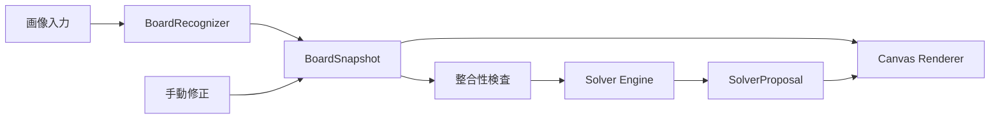

# Minesweeper Solver 全体設計

## 目的

デスクトップブラウザ内でマインスイーパの画面画像を解析し、再構築した盤面にsolverの提案を表示する。画像処理とsolverはすべてローカルで実行し、画像や盤面情報を外部へ送信しない。

主な利用手順は次のとおりとする。

1. ユーザーが盤面の横幅、縦幅、総地雷数を入力する。
2. 画面共有、クリップボード、または画像ファイルからゲーム画面を取得する。
3. 画像から盤面領域と各セルを認識する。
4. 認識結果に問題がなければ、次の一手を自動解析する。
5. 確定した安全セル、確定した地雷、または最良の推測候補を盤面へ重ねて表示する。
6. ゲームが進んだら同じ共有元から最新フレームを取得するか、新しい画像を取り込む。

## 対象範囲

### 含むもの

- Windows 95風デザインの対象ゲーム画面に特化した画像認識
- 画像からの盤面生成
- 認識結果の個別修正
- マウスとキーボードによる盤面操作
- 確定手と最良推測候補を求めるsolver
- 入力画像由来の旗とsolver提案の視覚的な区別
- 日本語の操作説明と状態表示
- デスクトップ向けレスポンシブレイアウト

### 含まないもの

- 外部ゲームの自動クリック
- バックエンドや外部解析API
- モバイル専用UI
- 任意のマインスイーパテーマを認識する汎用分類器
- solverの制約式や推論過程の画面表示
- 数値確率や候補配置数の画面表示
- 回転、遠近変形、または盤面の一部が欠けた画像への対応

## 対応環境

- ターゲットOSはデスクトップWindowsとする。
- 開発とCIはMacおよびLinuxで再現可能にする。
- OS固有APIを避け、Web標準APIを使用する。
- 最新Chromeを主要ブラウザとし、Edgeは同等の動作を想定する。
- FirefoxとSafariはWeb標準APIで自然にフォールバックできる範囲で対応する。
- 画面共有などの非対応機能があっても、ファイル入力など利用可能な経路を残す。
- 表示範囲は1280×800程度から1920×1080までを基準とし、FHD画面でのハーフ幅表示も考慮する。

## 技術構成

- Vite
- Vanilla TypeScript
- ES Modules
- Canvas 2D
- Web Worker
- Vitestによる単体テスト
- Chromiumを使うE2Eテスト

Reactは使用しない。主要処理がCanvas描画、画像ピクセル解析、制約計算であり、複雑なコンポーネント階層を必要としないためである。

## アーキテクチャ



### `input`

- `getDisplayMedia()`による画面、ウィンドウ、またはタブの共有
- 共有ストリームからの最新フレーム取得
- クリップボードの画像貼り付け
- 画像ファイルの選択
- ドラッグ＆ドロップ
- すべての入力を共通の画像形式へ変換

画面共有は最初に一度だけ共有元を選択する。共有中は同じストリームから最新フレームを取得できる。共有停止後は再選択を求める。

### `recognition`

- 画像から盤面矩形とセル領域を検出
- セルを閉じたセル、開いた空白、数字、旗へ分類
- 各分類の信頼度を算出
- 盤面サイズと残地雷数の推定候補を必要に応じて返す

認識実装は`BoardRecognizer`境界の内側へ隔離する。feasibility spikeの結果、Canvasによる決定論的解析を条件付きで採用する。対応範囲は収録元画像のnative scaleとoriginal encodingに限定し、0.75倍、1.25倍、およびJPEG quality 75で再圧縮された入力は非対応とする。この限定は実際の画面共有、クリップボード、ファイル入力へ一般化できることを示さないため、各入力経路が対応範囲を満たすかを製品実装計画の開始前に確認する。

画像のデコードと`ImageData`取得はメインスレッドで行い、認識コアには転送可能な画素バッファを渡す。製品版の認識コアはWeb Workerで実行し、テストとspikeでは同じ純粋関数を直接呼び出す。

### `domain`

盤面状態はDOM、Canvas、Workerから独立した型で表現する。認識された状態とsolver提案を分離し、solver結果で入力盤面を上書きしない。

```ts
type CellValue = "closed" | "flag" | 0 | 1 | 2 | 3 | 4 | 5 | 6 | 7 | 8;
type CellSource = "image" | "manual";

interface BoardCell {
  value: CellValue;
  source: CellSource;
  confidence: number;
}

interface BoardSnapshot {
  columns: number;
  rows: number;
  totalMines: number;
  cells: readonly BoardCell[];
  revision: number;
}

type SolverMark = "safe" | "mine" | "guess";

interface SolverProposal {
  revision: number;
  marks: ReadonlyMap<number, SolverMark>;
  flagPolicyUsed: "trusted" | "reconsidered";
  status: "solved" | "guess-required" | "inconsistent" | "limit-reached";
}
```

`revision`を使い、画像更新や手動修正より前に開始した非同期結果を破棄する。

### `validation`

- 低信頼度セルの検出
- 指定行列数と検出格子の不一致
- 数字より周囲の確定旗が多い局所矛盾
- 数字を満たす未確定セルが不足する局所矛盾
- 総地雷数、旗数、閉じたセル数の矛盾
- 複数制約を同時に満たす配置がない全体矛盾

認識の不確実性、盤面矛盾、確定手がない正常状態、探索上限到達を別の状態として扱う。

### `solver`

solverはUIと画像認識に依存しない純粋な制約solverとする。重い探索はWeb Workerで実行し、テストでは純粋関数として直接呼び出す。

### `board-renderer`

- 正方形セルを維持してCanvasへ描画
- 入力画像由来の旗、solverが確定した地雷、安全セル、推測候補を別レイヤーで描画
- 色に加えて記号、枠、マーカー形状で状態を区別
- 認識が不確実なセルを修正対象として強調

### `ui`

- Vanilla TypeScriptでDOMイベントと状態遷移を制御
- 日本語を標準表示とする
- 本格的な多言語基盤は導入しない
- 画面の使い方と色、記号の意味を説明する
- solverの推論過程は説明しない

## 初期盤面情報

ユーザーが入力する横幅、縦幅、総地雷数を正式な値とする。画像からの推定は入力補助であり、自動推定値と手入力が異なる場合は手入力を維持して警告する。

画像からの行列数、残地雷数、総地雷数補完はspikeの評価項目とする。これらが不採用でも、手入力によって主要フローは成立する。

## 画像取得から解析までの状態遷移

1. 初期盤面情報を入力する。
2. 画像を取得する。
3. `BoardRecognizer`が盤面とセルを認識する。
4. 低信頼度セルまたは認識矛盾があれば、solverを実行せず修正を待つ。
5. 認識が有効なら`BoardSnapshot`を更新する。
6. 自動的に次の一手を解析する。
7. `SolverProposal`を盤面へ重ねる。
8. 手動修正時は認識を再実行せず、検査とsolverだけを再実行する。

認識失敗時は直前の有効な盤面を消去しない。

## 盤面操作

- セルをクリックして選択
- 数字キー`0`〜`8`で数字を設定
- 閉じたセル、旗、開いた空白への変更
- マウス操作用セル種別パレット
- 盤面全体のリセット
- solverの再実行

## 旗の扱い

入力旗とsolverが確定した地雷は視覚的に区別する。

- 入力旗は通常の赤旗として表示する。
- solverが確定した地雷は赤旗に枠またはマーカーを追加する。
- solverが確定した安全セルは緑色のマーカーを表示する。
- 最良推測候補は緑色の`?`で表示する。

solverには次の設定を持たせる。

- 入力旗を再検討するか。
- 入力旗を尊重した解析が矛盾した場合、自動的に再検討するか。

既定では入力旗を確定地雷として尊重する。次のいずれかを検出し、自動再検討が有効な場合は、入力旗を未確定セルとして再解析する。

- 数字と周囲の入力旗が局所的に衝突する。
- 制約の組み合わせを満たす配置が存在しない。
- 総地雷数と盤面状態を満たす配置が存在しない。

誤った入力旗でも成立配置が存在する場合は自動検出できない。このリスクは尊重モードを選んだユーザーが引き受ける。完全な再評価が必要な場合は再検討モードを使用する。

## Solverアルゴリズム

各数字セルから次の制約を作る。

```text
周囲の未確定セルに含まれる地雷数
= 数字 - 確定地雷として扱う周囲の旗数
```

解析手順は次のとおりとする。

1. 残り地雷数が0なら周囲を安全と判定する。
2. 残り地雷数と未確定セル数が同じなら周囲を地雷と判定する。
3. 制約集合の包含関係から差分制約を作る。
4. 関係する未確定セルを独立した連結成分へ分割する。
5. 各成分の成立配置をバックトラックと枝刈りで列挙する。
6. 成分ごとの地雷数別配置数と、制約に接していない閉じたセルを総地雷数で統合する。
7. すべての成立配置で安全なセルと地雷のセルを確定する。
8. 確定手がなければ、内部確率が最良のセルを求める。

配置数は`BigInt`で保持する。最良候補の比率比較は可能な限り交差積で行い、浮動小数点の丸めによる順位逆転を避ける。

制約に接していない閉じたセルは一つずつ列挙せず、セル数`U`と割り当てる地雷数`R`に対する組み合わせ数`UCR`として扱う。`0 <= R <= U`なら、この領域は成立配置を持つ。

表示結果は次のとおりとする。

- 確定安全セル
- 確定地雷セル
- 確定手がない場合の最良推測候補

同率候補が複数ある場合は同率候補を示し、そのうち一つを主候補として強調する。数値確率、配置数、制約式は表示しない。

探索が実用上の上限に達した場合は、すでに得られた確定結果だけを返し、探索上限到達として表示する。盤面矛盾とは区別する。

## レスポンシブレイアウト

- 盤面横に情報欄を置いてもセルの最低表示寸法を保てる場合、右サイドバーを使用する。
- 最低表示寸法を保てない場合、情報欄を盤面の下へ移動する。
- セルは常に正方形とする。
- Canvas内部にはスクロールを設けない。
- 必要な縦スクロールはページ全体に限定する。
- ブレークポイントは画面幅だけでなく、列数と利用可能幅から求めるセル寸法を基準にする。
- 右サイドバーを置いた状態でセルが24 CSS px未満になる場合は縦配置へ切り替える。

## エラー処理

### 画像取得

- 画面共有が未対応
- 共有がキャンセルされた
- 共有が終了した
- クリップボードに画像がない
- 対応できない画像形式
- ファイルを読み込めない

### 画像認識

- 盤面を検出できない
- 一部セルの信頼度が不足
- 指定行列数と検出格子が不一致
- 盤面が画像外へ欠けている
- 自動推定値と手入力が不一致

### Solver

- 入力旗との局所衝突
- 制約全体を満たす配置がない
- 総地雷数との矛盾
- 確定手がなく推測が必要
- 探索上限到達
- Worker異常終了

## プライバシー

- 画像と盤面情報をサーバーへ送信しない。
- 外部解析APIを使用しない。
- 画面共有ストリームをユーザーが停止できるようにする。
- ページ終了時に共有トラックを停止する。
- 本番版にバックエンドを設けない。
- 診断情報へ元画像を自動保存しない。

## テスト戦略

### 認識コア

- fixtureごとの盤面矩形、セル境界、分類、信頼度
- 縮小、拡大、JPEG再圧縮による派生ケース
- 認識結果JSONと重ね合わせ画像による目視確認
- fixtureに存在するセル状態を保証対象とする
- 未収録の希少状態は画像取得後にfixtureとテストを追加する

### Solver

- 小盤面を総当たりするテスト用oracleとの比較
- 基本規則と集合差分
- 独立成分への分割
- 制約なし領域
- 全体地雷数による統合
- `BigInt`による配置数
- 入力旗の尊重、再検討、自動フォールバック
- 局所的には正常だが全体では矛盾する盤面
- 同率の最良候補

### UI

- マウスとキーボードによる盤面修正
- 画像由来とsolver由来の表示区別
- 認識失敗時の盤面保持
- 盤面revisionと非同期結果の整合
- 旗設定の切り替え

### E2E

- Chromiumで画像ファイル入力からsolver表示までを検証する。
- クリップボードと画面共有はブラウザ境界を抽象化して自動テストする。
- 実際の画面共有選択はWindows Chromeで手動確認する。
- 1920×1080、1280×800、FHDハーフ幅相当でレイアウトを確認する。
- 正方形セルとCanvas内スクロール不在を確認する。

## 実施順序

1. 画像認識feasibility spikeを実施する。
2. spikeの結果に基づいて`BoardRecognizer`実装を選択する。
3. 結果を本設計へ反映する。
4. 本実装の実装計画を作成する。
5. 盤面モデル、solver、画像入力、認識、描画、UIの順に統合する。

spikeが長期化しても、認識境界以外の設計は変更せず保持する。
